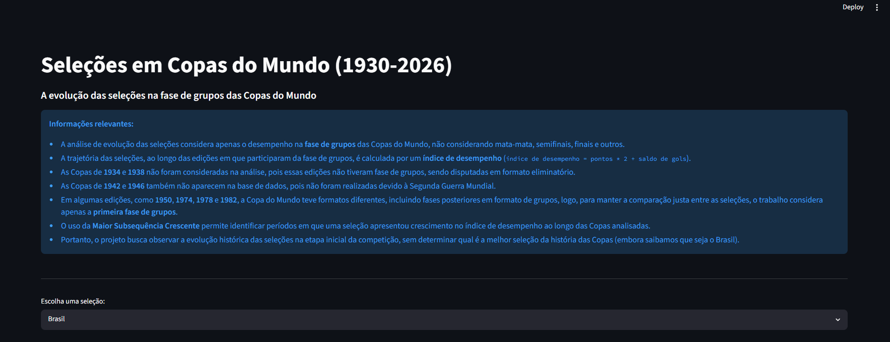
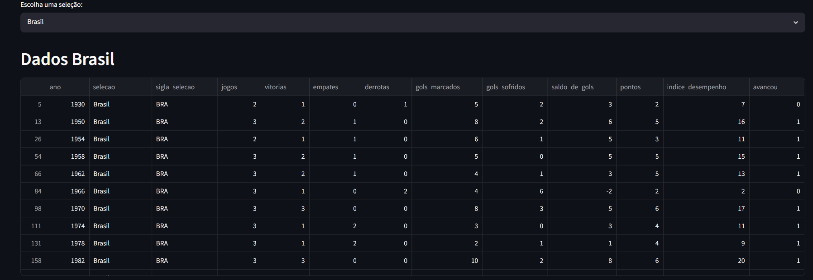
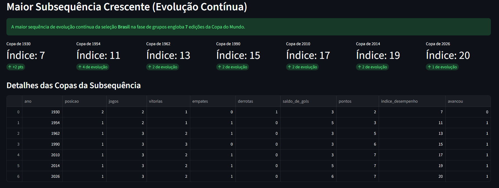

# Analisador de Seleções em Copas do Mundo

**Número da Lista**: 4<br>
**Conteúdo da Disciplina**: Programação Dinâmica<br>

## Alunos
| Matrícula | Aluno |
| -- | -- |
| 23/1011220 | Davi Camilo Menezes |
| 23/1011800 | Rafael Welz Schadt |

## Sobre
O **Analisador de Seleções** é uma aplicação desenvolvida para analisar o desempenho histórico das seleções na fase de grupos das Copas do Mundo (1930-2026). O objetivo do trabalho é identificar períodos em que uma seleção apresentou crescimento em seu desempenho ao longo das edições do torneio.

Para isso, o sistema calcula um índice de desempenho com base na pontuação e no saldo de gols de cada seleção, utilizando a fórmula `índice de desempenho = pontos * 2 + saldo de gols`. Em seguida, os dados são organizados em ordem cronológica, para que assim seja possível acompanhar a trajetória de cada país nas Copas analisadas.

A partir desses índices, o projeto aplica o algoritmo de **Maior Subsequência Crescente** para encontrar a maior sequência de Copas em que o desempenho da seleção, escolhida pelo usuário, aumentou progressivamente, considerando exclusivamente a fase de grupos.

## Screenshots
A seguir estão imagens do projeto em funcionamento.


*Visão geral da aplicação e regras.*


*Exibição dos dados filtrados para a seleção escolhida.*


*Resultado do algoritmo de Maior Subsequência Crescente, destacando a evolução da seleção Brasileira, nesse exemplo.*

## Instalação
**Linguagem**: Python<br>
**Framework**: Streamlit<br>
**Pré-requisitos:** Todos os requirements instalados<br>

### Como rodar
1. Clonar o repositório para a sua máquina
```bash
git clone https://github.com/projeto-de-algoritmos-2026/PD_Analisador-de-selecoes-em-copas-do-mundo.git
```

2. Navegar até o diretório do projeto
```bash
cd PD_Analisador-de-selecoes-em-copas-do-mundo
```

3. Instalar as dependências
```bash
python -m pip install -r requirements.txt
```

4. Executar a aplicação
```bash
python -m streamlit run app.py
```

**Observações**
- A aplicação é executada localmente por meio do *Streamlit* e disponibilizada em uma interface web, a qual é aberta automaticamente no navegador.
- Se `python` não estiver disponível no seu terminal, use `python3` nos comandos acima.
## Uso

Após executar o comando de inicialização, siga os passos abaixo para utilizar o projeto:

1. **Acesse a aplicação:** O seu navegador padrão abrirá automaticamente a interface do *Streamlit*.
2. **Leia as diretrizes:** Na tela inicial, confira o painel informativo para entender como o **índice de desempenho** é calculado, e quais critérios históricos foram adotados na base de dados (como a exclusão das edições sem fase de grupos).
3. **Escolha uma seleção:** Utilize a caixa de seleção (dropdown) intitulada **"Escolha uma seleção:"** para buscar o país que deseja analisar. Você pode digitar o nome da seleção para facilitar a busca.
4. **Analise os dados históricos:** Logo abaixo, o sistema exibirá uma tabela detalhada com todas as participações daquela seleção na primeira fase de grupos, além de um gráfico de linhas mostrando a variação do seu rendimento ao longo dos anos.
5. **Visualize a Maior Subsequência Crescente:** Role a página até a seção final para conferir o resultado do algoritmo. O sistema destacará a maior sequência de edições que a seleção apresentou uma evolução contínua em seu desempenho, exibindo os dados em cards interativos.

## Vídeo de Apresentação
Link para o vídeo de apresentação e demonstração do trabalho: [Clique aqui]()
